# Biểu Đồ Mermaid - Mini Social Network

Tài liệu này cung cấp các biểu đồ Mermaid để dễ dàng render trong các công cụ hỗ trợ Markdown.

---

## 1. Biểu Đồ Kiến Trúc Hệ Thống (System Architecture)

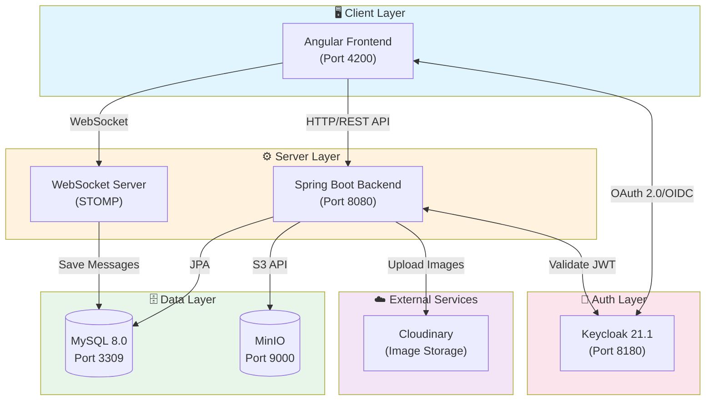

---

## 2. Biểu Đồ ERD (Entity Relationship Diagram)

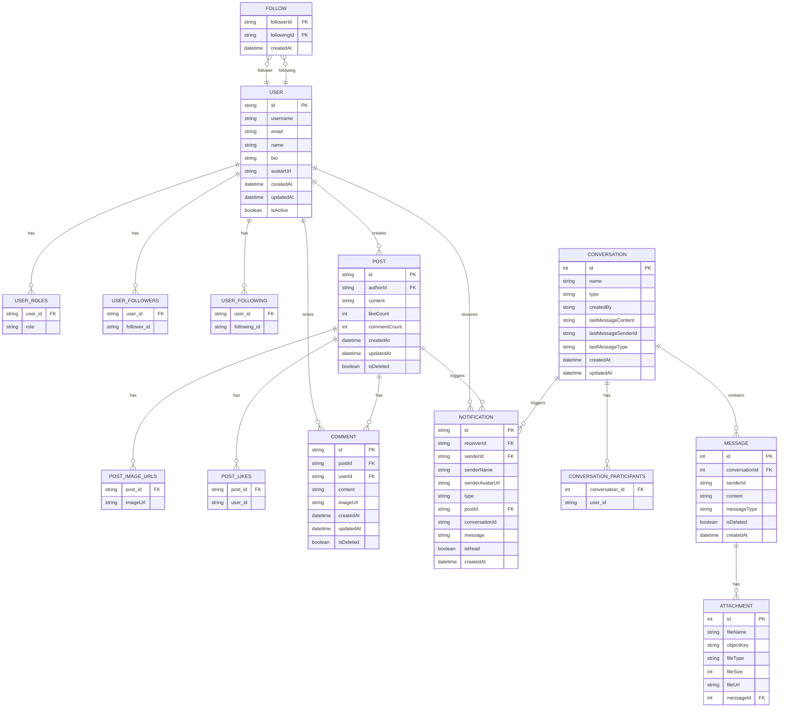

### Ghi Chú ERD:
- **Bảng phụ `*_ROLES`, `*_FOLLOWERS`, `*_FOLLOWING`, `*_IMAGE_URLS`, `*_LIKES`**: Được tạo tự động bởi JPA `@ElementCollection`
- **FOLLOW**: Sử dụng composite primary key (`followerId` + `followingId`) qua `@EmbeddedId`
- **CONVERSATION**: Có các trường denormalized (`lastMessageContent`, `lastMessageSenderId`, `lastMessageType`) để tối ưu hiệu suất khi hiển thị danh sách chat
- **Soft Delete**: Các entity `POST`, `COMMENT`, `MESSAGE` sử dụng cờ `isDeleted` thay vì xóa thật
- **NOTIFICATION Types**: 
  - `LIKE` → link đến `POST` (qua `postId`)
  - `COMMENT` → link đến `POST` (qua `postId`)
  - `FOLLOW` → không có relation ngoài `senderId`/`receiverId`
  - `MESSAGE` → link đến `CONVERSATION` (qua `conversationId`)

---

## 3. Luồng Xác Thực (Authentication Flow)

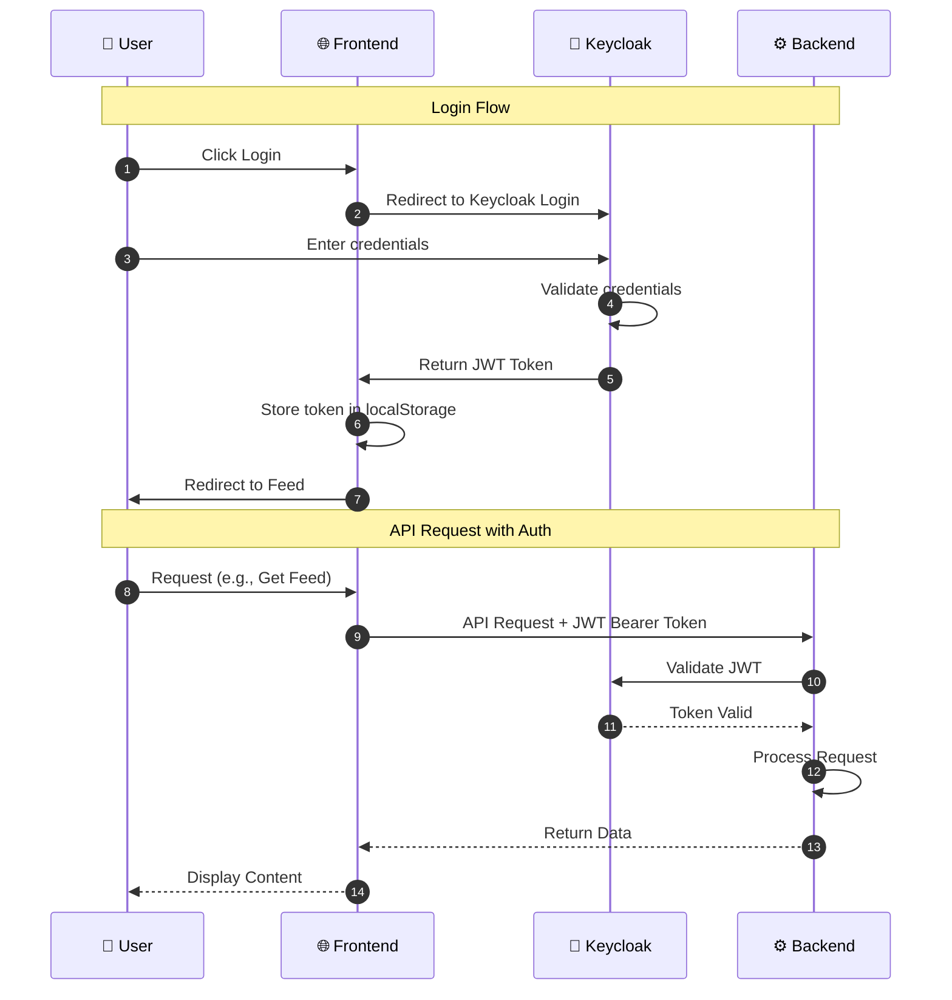

---

## 4. Luồng Tạo Bài Viết (Create Post Flow)

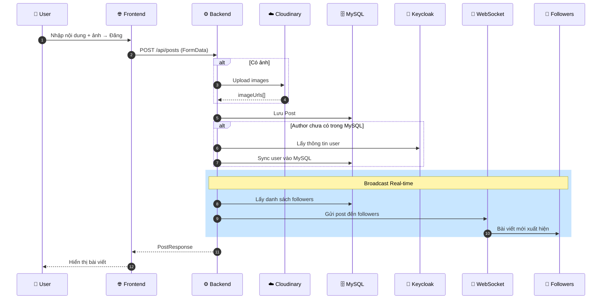

### Mô tả:
1. User nhập nội dung/ảnh và nhấn Đăng
2. Nếu có ảnh → upload lên Cloudinary
3. Lưu bài viết vào MySQL
4. Nếu user chưa có trong MySQL → sync từ Keycloak
5. Broadcast bài viết mới đến followers qua WebSocket
6. Hiển thị bài viết trên Feed

---

## 5. Luồng Like và Thông Báo (Like & Notification Flow)

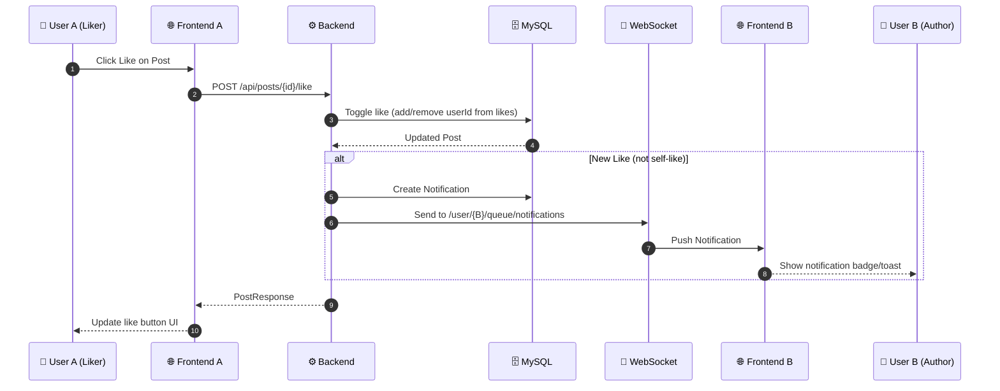

---

## 6. Luồng Chat Real-time (Real-time Chat Flow)

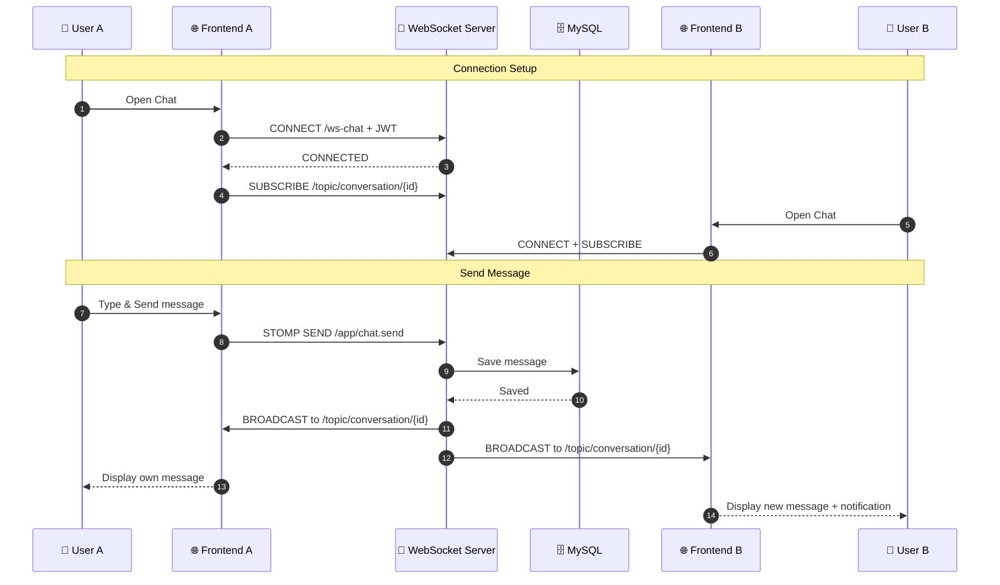

---

## 7. Luồng Follow (Follow Flow)

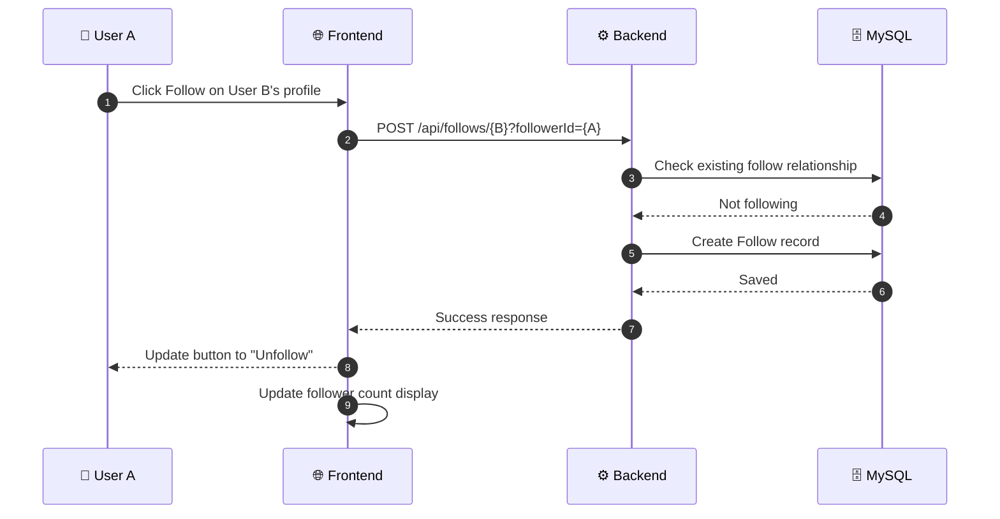

---

## 8. Luồng Comment và Thông Báo (Comment & Notification Flow)

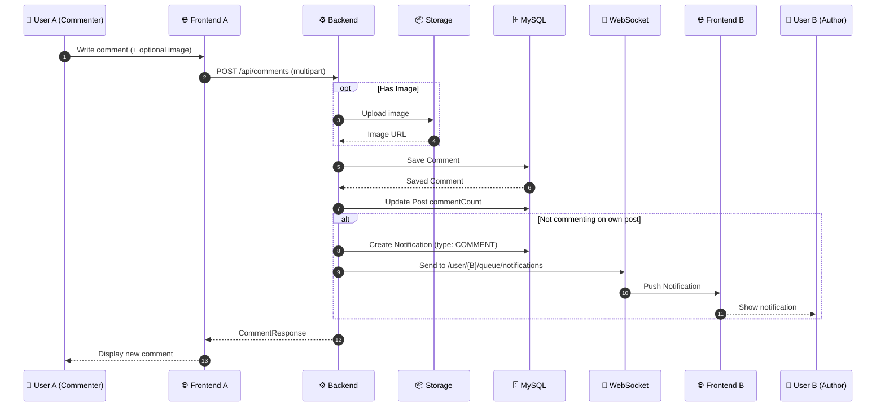

---

## 9. Sơ Đồ Thành Phần Frontend (Frontend Component Diagram)

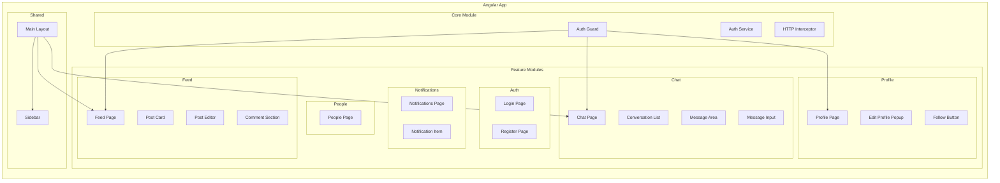

---

## 10. Sơ Đồ Thành Phần Backend (Backend Component Diagram)

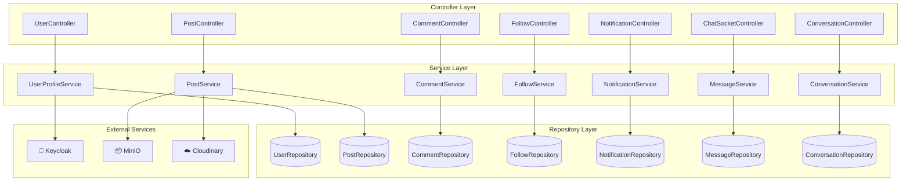

---

## 11. Use Case Diagram

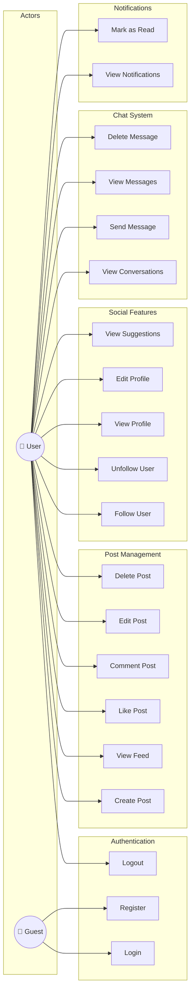

---

## 12. Deployment Diagram

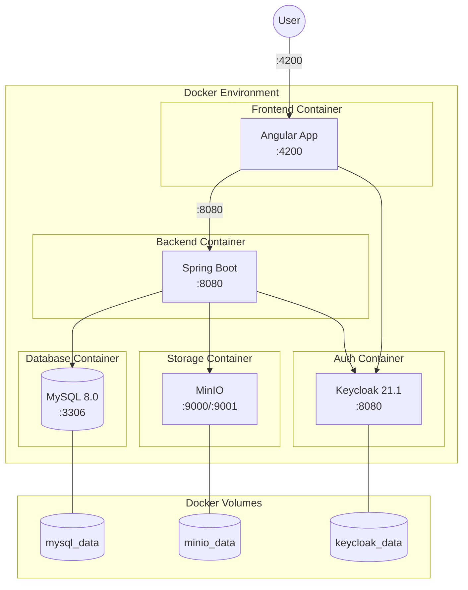

---

## 13. Notification Types State Diagram

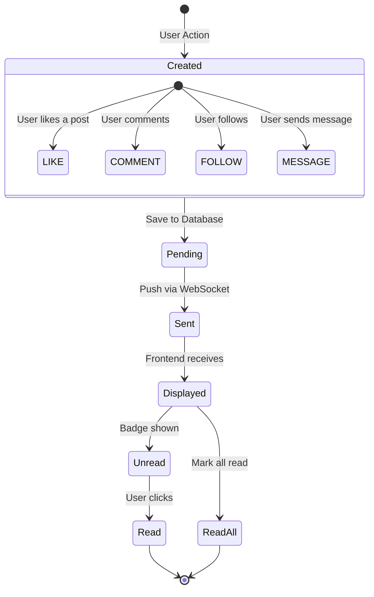

---

## Ghi Chú

Các biểu đồ Mermaid trên có thể được render trong:
- **GitHub** (README.md, Issue, PR)
- **GitLab** 
- **VS Code** (với extension Markdown Preview Mermaid Support)
- **Notion**
- **Obsidian**
- **Mermaid Live Editor**: https://mermaid.live/

Để sử dụng trong báo cáo Word/PDF, có thể:
1. Export từ Mermaid Live Editor
2. Screenshot từ VS Code preview
3. Sử dụng tool như `mermaid-cli` để generate images
